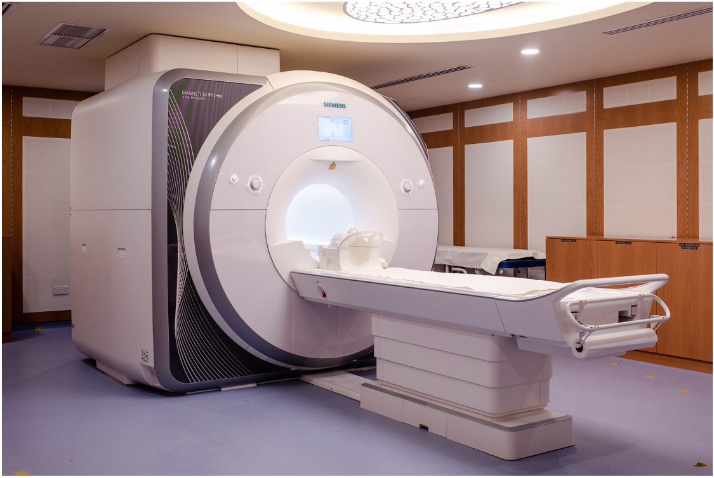
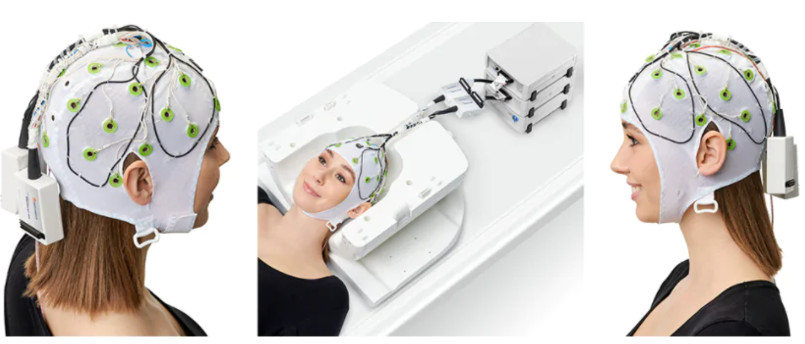
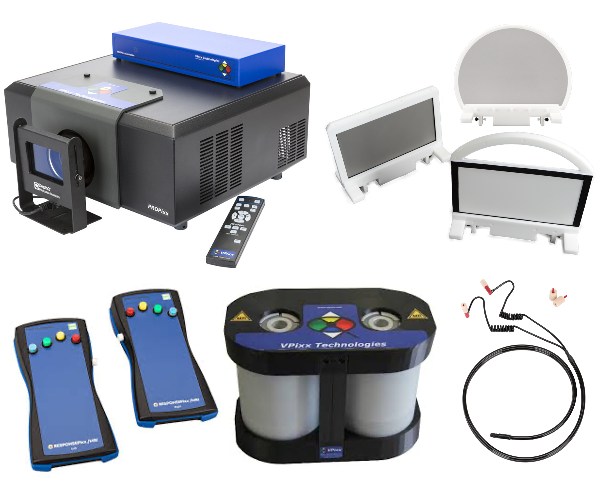

**************************
Brain Imaging Lab Overview
**************************

.. image:: ../_static/mri_scanner.png
   :alt: MRI scanner image
   :width: 1200px
   :align: center

.. raw:: html

    

.. raw:: html

    

Brain Imaging Lab description
#############################

3T Siemens Prisma MRI Scanner
*****************************

   Figure 1. MRI scanner at NYU Abu Dhabi

NYU Abu Dhabi’s MRI lab features a 3T Siemens Prisma system, installed in 2017. This was the first research-dedicated MRI scanner in the Gulf region, signifying an important milestone for scientific progress in the area. Positioned within the NYU Abu Dhabi campus, the facility supports advanced investigations in neuroscience, psychology, and biomedical research. The Prisma MRI scanner, optimised for research, provides exceptionally detailed images of the brain and body. This capability enables researchers to delve into the intricacies of brain connectivity, examine cognitive processes, and explore potential strategies for diagnosing and treating neurological disorders. By fostering interdisciplinary collaborations among scientists, engineers, and clinicians, the MRI lab at NYU Abu Dhabi stands at the forefront of cutting-edge research that aims to deepen our understanding of both the human body and mind.

MRI Compatible EEG System from Brain Products
****************************************

   Figure 2. EEG System

We have an EEG system that complements fMRI by measuring electrical changes in the brain, while fMRI measures hemodynamic changes. Because EEG and fMRI provide distinct spatial and temporal information, combining the two requires special considerations for data quality and participant safety. Our setup includes MR-conditional amplifiers certified by major scanner vendors, with the option to add sensors like accelerometers or GSR for broader physiological monitoring. We have online viewing software allowing for real-time processing to ensure data quality throughout each recording session.

Vpixx System
************
VPixx systems provide MRI researchers with tools that deliver precise, reliable, and highly synchronized visual and often auditory stimuli inside the scanning environment. In particular, the PROPixx projector’s long-throw lens options and robust design allow the device to be placed safely outside the MRI room while projecting clear, stable images into the bore. These systems also integrate trigger inputs/outputs and analog I/O so that the presentation of stimuli can be tightly coordinated with scanner pulses, ensuring that changes in brain activity, captured by MRI, line up exactly with the onset of visual or auditory events.

The system includes:
--------------------
    - a PROPixx projector
    - an in-bore screen
    - left and right-hand response boxes
    - soundpixx

   Figure 3. VPixx System
