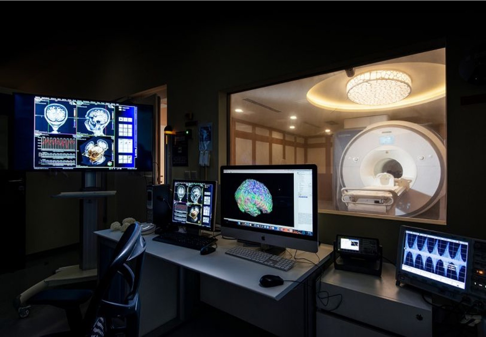

**************************
Brain Imaging Lab Overview
**************************

   Figure 1. MRI scanner at NYU Abu Dhabi

.. raw:: html

    

.. raw:: html

    

Brain Imaging Lab description
#############################

3T Siemens Prisma MRI Scanner
*****************************

.. figure:: ../_static/mri scanner_inside.png
   :alt: MRI scanner image
   :width: 800px
   :align: center

   Figure 1. MRI scanner at NYU Abu Dhabi

NYU Abu Dhabi’s MRI lab features a 3T Siemens Prisma system, installed in 2017. This was the first research-dedicated MRI scanner in the Gulf region, signifying an important milestone for scientific progress in the area. Positioned within the NYU Abu Dhabi campus, the facility supports advanced investigations in neuroscience, psychology, and biomedical research. The Prisma MRI scanner, optimised for research, provides exceptionally detailed images of the brain and body. This capability enables researchers to delve into the intricacies of brain connectivity, examine cognitive processes, and explore potential strategies for diagnosing and treating neurological disorders. By fostering interdisciplinary collaborations among scientists, engineers, and clinicians, the MRI lab at NYU Abu Dhabi stands at the forefront of cutting-edge research that aims to deepen our understanding of both the human body and mind.

