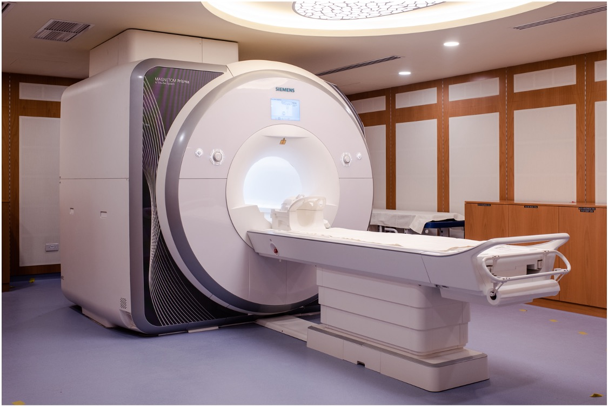
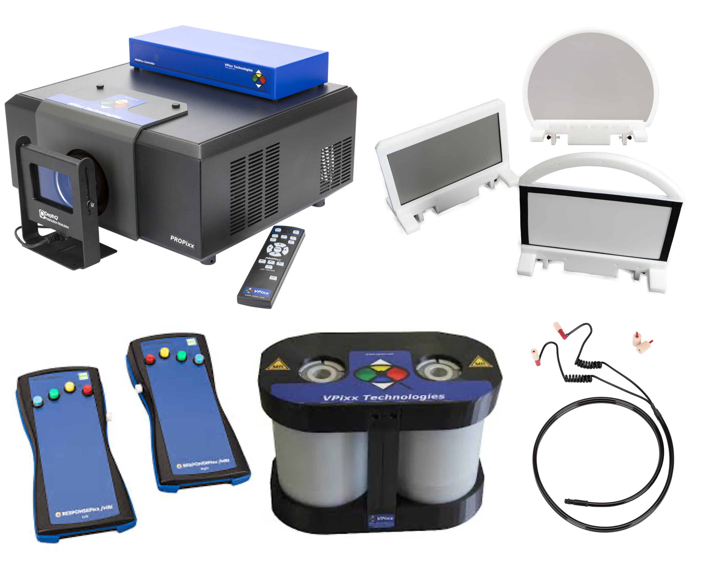

MRI system components
=====================

3T Siemens Prisma MRI Scanner
*****************************

   Figure 1. MRI scanner at NYU Abu Dhabi

NYU Abu Dhabi’s MRI lab features a 3T Siemens Prisma system.

Specifications
^^^^^^^^^^^^^^

    - **Field strength**: 3 Tesla
    - **Bore size**: 60 cm
    - **System length**: 213 cm
    - **System weight (in operation)**: 13 tons
    - **Gradient strength**: XR Gradients (139 mT/m8 @ 346 T/m/s8)
    - **Max. amplitude**: 139 mT/m8
    - **Max. slew rate**: 346 T/m/s8

Available coils
^^^^^^^^^^^^^^^

    - **Head/Neck 64**
      Ultra-fast, high SNR, head and neck imaging.

    - **32-Channel Head Coil**
      iPAT-compatible coil for fast high-resolution and advanced neuro imaging.

    - **Tx/Rx CP Head Coil**
      CP Send/Receive head coil with integrated preamplifier.

    - **Head/Neck 20**
      For examination of head and neck (brain, neck blood vessels, and C-spine).

    - **Body 18**
      Light-weight coil with SlideConnect® technology for easy coil set up and
      excellent patient comfort. Typically used with the Spine 32 for thorax,
      abdomen, pelvis, or hip exams. Also well suited for cardiac or vascular applications.

    - **Body 30**
      Flexible and comfortable coil for full Field of View coverage and patient comfort.
      Typically used for pelvis (particularly prostate), hip, abdomen, or thorax exams.
      Often combined with the Spine coil or other coils for cardiac/vascular applications.

    - **Tx/Rx Knee 15 Flare Coil**
      15-channel transmit/receive coil for high-resolution knee imaging, featuring
      a flared opening for better patient fit.

    - **4-Channel Flex Coils**
      Multipurpose coils for orthopedic imaging and other specialized applications.

    - **4-Channel Special-Purpose Coil**
      A no-tune receiver coil designed for small Field-of-View exams.

    - **Spine Matrix Coil**
      24-element design with 24 integrated preamplifiers, 8 clusters of 3 elements each.
      Integrated into the patient table, works with Head and Neck Matrix coils.

MRI Compatible EEG System from Brain Products
*********************************************

.. figure:: ../_static/eeg.png
   :alt: eeg
   :width: 800px
   :align: center

   Figure 2. EEG System

We have an EEG system that complements fMRI by measuring electrical changes in the brain, while fMRI measures hemodynamic changes. Because EEG and fMRI provide distinct spatial and temporal information, combining the two requires special considerations for data quality and participant safety. Our setup includes MR-conditional amplifiers certified by major scanner vendors, with the option to add sensors like accelerometers or GSR for broader physiological monitoring. We have online viewing software allowing for real-time processing to ensure data quality throughout each recording session.

Vpixx System
------------

VPixx systems provide MRI researchers with tools that deliver precise, reliable, and highly synchronized visual and often auditory stimuli inside the scanning environment. In particular, the PROPixx projector’s long-throw lens options and robust design allow the device to be placed safely outside the MRI room while projecting clear, stable images into the bore. These systems also integrate trigger inputs/outputs and analog I/O so that the presentation of stimuli can be tightly coordinated with scanner pulses, ensuring that changes in brain activity, captured by MRI, line up exactly with the onset of visual or auditory events.

The system includes:

    - a PROPixx projector
    - an in-bore screen
    - left and right-hand response boxes
    - soundpixx

   Figure 3. VPixx System

