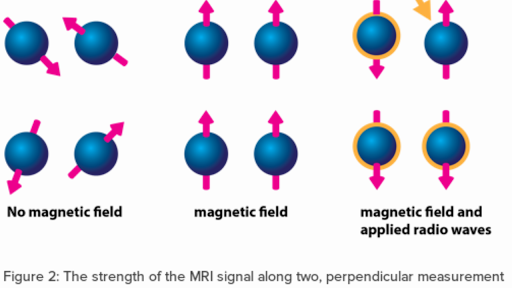
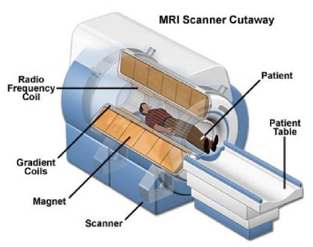
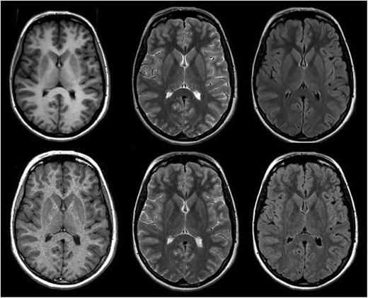

-------------------
Technology Overview
-------------------

Overview of Magnetic Resonance Imaging (MRI)
********************************************

.. image:: ../_static/mri_scanner_inside.png
   :alt: Typical MRI machine
   :width: 800px
   :align: center

Magnetic Resonance Imaging (MRI) is a sophisticated medical imaging technology that allows physicians to visualize
internal structures of the body with exceptional clarity and detail. Unlike X-rays and CT scans, MRI does not use
ionizing radiation. Instead, it uses powerful magnetic fields and radiofrequency (RF) pulses to generate detailed images of soft tissues, organs, bones, and blood vessels.

Basic Principles
----------------

MRI technology is rooted in the principle of nuclear magnetic resonance (NMR). The human body primarily consists of water molecules, which contain hydrogen nuclei (protons). When the patient is placed in a strong magnetic field, these protons align themselves along the field. An RF pulse temporarily disturbs this alignment. Once the pulse stops, the protons emit energy signals as they realign with the magnetic field. These signals are captured and processed into images.

Components of an MRI Scanner
----------------------------

- **Main Magnet**: Usually a superconducting magnet, generating a very strong, stable magnetic field.
- **Gradient Coils**: Produce secondary magnetic fields that allow precise spatial localization and imaging.
- **RF Coils**: Specialized coils used to transmit RF pulses and detect the signals emitted from the body's tissues.
- **Computer System**: Processes the collected signals using sophisticated algorithms to produce highly detailed images.
- **Patient Table and Housing**: Provides stable positioning for the patient and houses electronic systems.

Types of MRI Sequences
----------------------

- **T1-weighted images**: Provide excellent anatomical detail. Fat tissue appears bright, while fluid appears dark.
- **T2-weighted images**: Highlight fluid-rich areas, making them suitable for detecting inflammation, edema, and infections.
- **Diffusion-weighted imaging (DWI)**: Sensitive to the random motion of water molecules, crucial for early detection of stroke and tumor characterization.
- **Functional MRI (fMRI)**: Measures brain activity by detecting oxygenation changes, essential in cognitive and neuroscience research.

Clinical Applications of MRI
----------------------------

- **Neurology**: Diagnosis and monitoring of brain tumors, stroke, multiple sclerosis, dementia, and epilepsy.
- **Orthopedics**: Assessment of joints, ligaments, cartilage, and bones to diagnose injuries and degenerative diseases.
- **Cardiology**: Detailed imaging of the heart to evaluate congenital defects, cardiomyopathies, and vascular diseases.
- **Oncology**: Detection, staging, and monitoring response to treatment for various cancers.
- **Functional Imaging**: Mapping brain functions and connectivity for surgical planning and research purposes.

Advantages and Limitations
--------------------------

**Advantages:**

- Non-invasive imaging without harmful radiation
- Excellent soft-tissue contrast for clear differentiation between tissue types
- Multi-directional imaging capabilities
- Versatility with multiple imaging sequences and functional imaging

**Limitations:**

- High operational costs and longer scanning times compared to other modalities
- Potential discomfort or anxiety due to noise and confined space
- Contraindicated for patients with metallic implants or pacemakers

MRI Safety and Precautions
--------------------------

MRI is a safe modality when appropriate safety protocols are followed, including screening for metallic implants, hearing protection, and continuous patient monitoring.

Future Developments in MRI
--------------------------

Advancements continue to improve MRI technology, including faster imaging techniques, higher field strength magnets, AI integration, and portable MRI systems.

