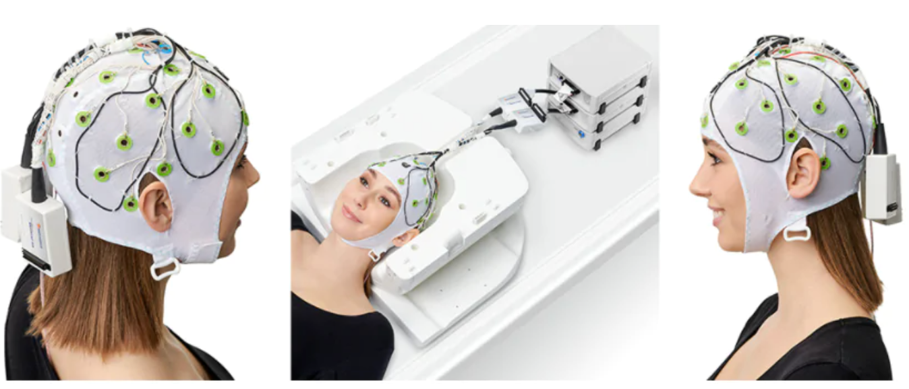

--------------------------------
EEG compatible fMRI System setup
--------------------------------

The MRI lab is equipped with an fMRI compatible EEG system from BrainProducts installed on the 24th of september 2024.

fMRI and EEG data can be collected simultaneously to benefit from the high spatial resolution of fMRI
and the high temporal resolution of EEG.

However, noise is induced from the MRI onto the EEG data due to the gradient artifacts, those must be removed to make the EEG data usable.
Therefore, special analysis pipelines are needed. Additionally, designing an EEG/fMRI experiment demands taking into consideration specific requirements.

EEG/fMRI documentation PDF `download from here <https://github.com/Hzaatiti/meg-pipeline/releases/tag/v-report-docs>`_

MRI Compatible EEG System from Brain Products
^^^^^^^^^^^^^^^^^^^^^^^^^^^^^^^^^^^^^^^^^^^^^

   Figure 2. EEG System

We have an EEG system that complements fMRI by measuring electrical changes in the brain, while fMRI measures hemodynamic changes. Because EEG and fMRI provide distinct spatial and temporal information, combining the two requires special considerations for data quality and participant safety. Our setup includes MR-conditional amplifiers certified by major scanner vendors, with the option to add sensors like accelerometers or GSR for broader physiological monitoring. We have online viewing software allowing for real-time processing to ensure data quality throughout each recording session.

Operational protocol and SOP
============================

- Operational Protocol :ref:`brainamp_mr_plus_sop`
- SOP `download from here <https://github.com/Hzaatiti/meg-pipeline/releases/tag/v-report-docs>`_
- Data storage information and currently available data :ref:`eeg-fmri-data`
- Important guideline for designing your EEG-fMRI experiment can be found here :ref:`eeg-fmri-experiment`

Example Experiments EEG-FMRI
============================

.. nbgallery::
    :name: rst-gallery
    :glob:

    ../5-mri-experiments-gallery/experiments/eeg-fmri/*

Pipelines Processing EEG-FMRI data
==================================

.. nbgallery::
    :glob:

    ../7-mri-pipeline-gallery/notebooks/eeg-fmri/*

