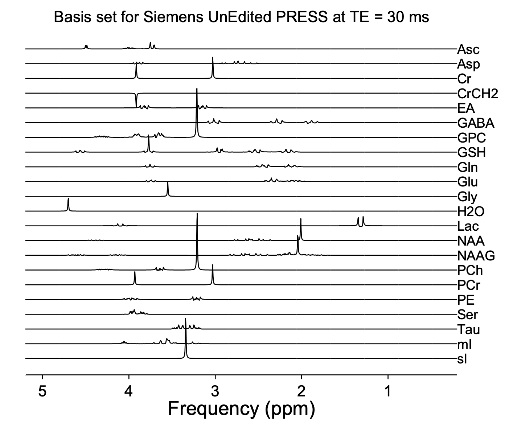
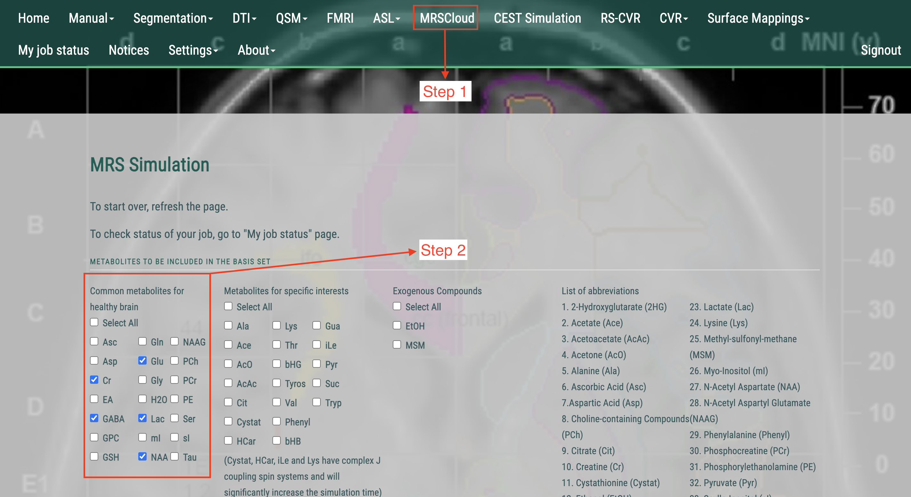
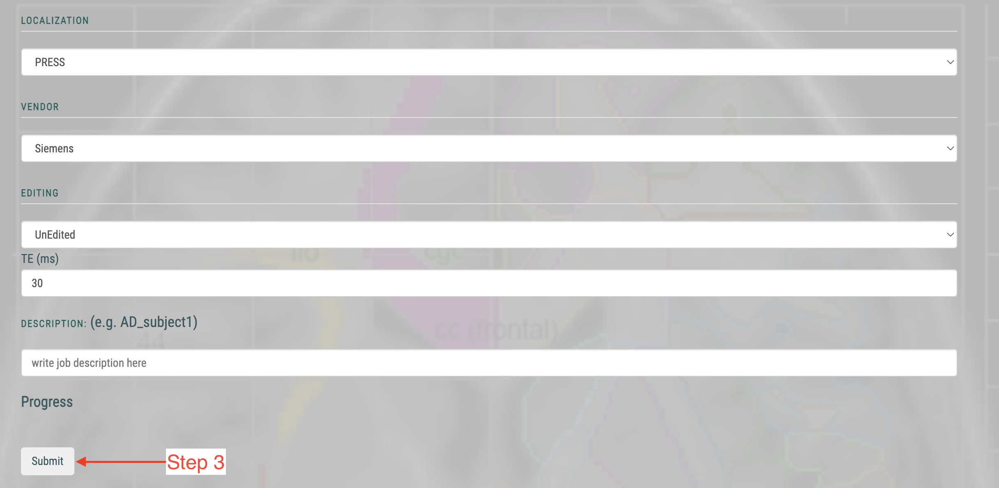
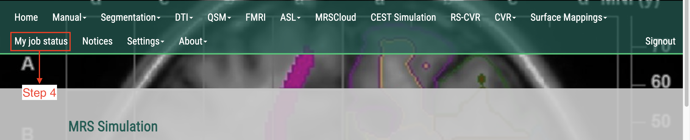
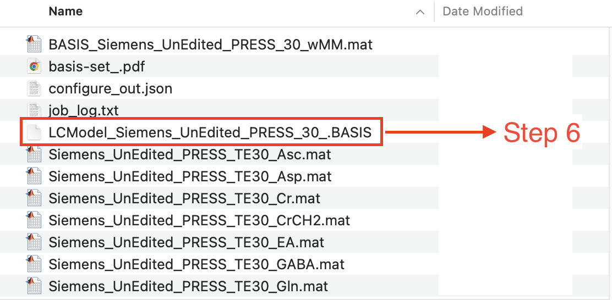

Generating the Basis File
=========================

Why a Basis File?
-----------------

The basis file is a simulated library of metabolite spectra that LCModel uses to fit your experimental data. It defines the expected spectral signatures of individual metabolites and is crucial for accurate quantification.

Simulation Using MRSCloud
-------------------------

1. **Accessing MRSCloud**
   Visit `MRSCloud <https://braingps.mricloud.org/>`_ and sign in with your credentials.

2. **Configuration for Simulation**
   * **Module:** Select "MRSCloud"
   * **Phantom Case:** Choose the phantom case that matches your experimental setup
   * **Metabolites:** Select the corresponding metabolites (e.g., the seven metabolites present in your phantom)
   * **Simulation Settings:**
     * **Localization:** PRESS
     * **Vendor:** Siemens
     * **Editing:** unEdited
     * **TE:** 30 ms

|

|

.. image:: ../graphic/mrscloud4.png
   :alt: MRSCloud configuration interface
   :align: center

|

3. **Download and Extract**
   Submit the simulation. Once processed, download the ZIP file containing the simulated basis set. Unzip the file and select the file with the `.BASIS` extension. This file will be used later in LCModel. 