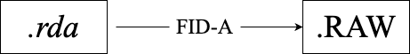

Data Acquisition and Conversion
===============================

Overview
--------

MR spectroscopy data is initially exported from the scanner as `.rda` files. However, LCModel requires data in `.RAW` format. Converting from `.rda` to `.RAW` involves more than simply renaming the file—it requires reading the data and writing it out in a compatible format.

Procedure
---------

1. **Data Export**
   Export your raw spectroscopy data from the scanner, which is typically saved in the `.rda` format.

2. **Conversion with FID-A Toolbox (MATLAB)**
   Use the FID-A toolbox to load and convert the files. The following MATLAB script demonstrates the process:

   .. code-block:: matlab

      % Add FID-A to MATLAB path
      addpath(genpath('/Users/SH7437/FID-A-master'));

      % Load the RDA files for suppressed and unsuppressed acquisitions
      in_suppressed = io_loadspec_rda('/Users/SH7437/Desktop/suppressed.rda');
      in_unsuppressed = io_loadspec_rda('/Users/SH7437/Desktop/unsuppressed.rda');

      % Set the echo time (TE) in milliseconds (update as needed)
      TE = 30;

      % Write out .RAW files for LCModel usage
      io_writelcm(in_suppressed, '/Users/SH7437/Desktop/suppressed.raw', TE);
      io_writelcm(in_unsuppressed, '/Users/SH7437/Desktop/unsuppressed.raw', TE);

Key Points
----------

* The function ``io_loadspec_rda`` reads the RDA file
* The function ``io_writelcm`` writes the data into the `.RAW` format needed by LCModel
* Adjust the TE (echo time) as per your experimental settings 