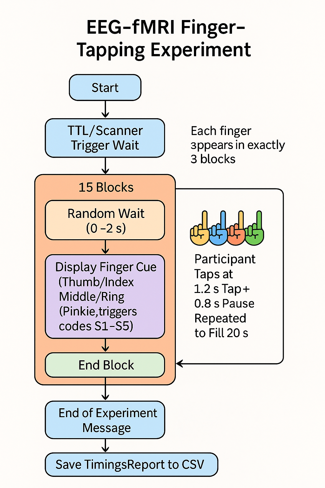

------------------------------------
EEG-fMRI - Finger-tapping experiment
------------------------------------

Context
^^^^^^^

In this experiment, the participant will tap each finger in a random order for 20 seconds continuously.
The participant is asked by a text message to tap and then stop.
As an EEG-fMRI experiment, it is important that the action is not repeated continuously during the block, otherwise we would not get clean EEG ERPs.
If we are doing frequency analysis of the EEG data, then it is possible to repeat continuously the action throughout the block duration.
This is repeated 3 times per finger, so a total of 15 blocks.

Code
^^^^

The experiment is coded in PsychToolBox.
The experiment folder found in the `experiments` folder on the github repository, contains:

- `main.m` main file to run for experiment
- `loadParameters.m` defines the parameters for the experiment
    - your radiographer needs to be aware of this duration
        - the block duration is 20 seconds,
        - the number of blocks are 15 blocks
    - maxRandWaitTime, this is the interblock random time duration necessary for any EEG-fMRI experiment
    - tapduration is set to 1.2 seconds
    - pauseduration is 0.8 seconds
- one run is therefore 15 blocks * 20 seconds = 300 seconds
- each finger is represented by 3 blocks per run
- The acquired data for this experiment is 3 runs, therefore each finger was acquired for 9 blocks
- the condition for the fingers are numbered as
    - 1 Thumb
    - 2 Index
    - 3 Middle
    - 4 Ring
    - 5 Pinkie

    Finger tapping experiment diagram

.. dropdown:: Finger Tapping task code

    .. literalinclude:: ../../../../../experiments/EEG-FMRI/finger-tapping/main.m
      :language: matlab
